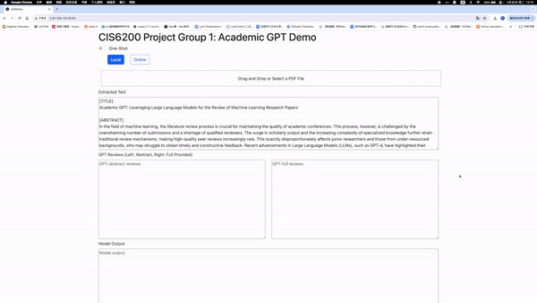

# Machine Learning Paper Reviews GPT

<p align="center">
  
</p>


---

## Description
This project, developed as a final project for [UPenn CIS6200 Advanced Topics in Deep Learning](https://docs.google.com/document/d/1dkQ4XRhaiZFjGu5i_8Qcoi6MkHwOfivmFFWhBrBF30I/edit), explores the use of large language models (LLMs) for generating reviews of machine learning papers. It is inspired by ["Can large language models provide useful feedback on research papers? A large-scale empirical analysis"](https://arxiv.org/pdf/2310.01783.pdf), utilizing similar techniques. The project consists of two primary components: the review generation pipeline and the evaluation pipeline. The review generation pipeline uses both a fine-tuned model and GPT-3.5-turbo and GPT-4-turbo as baselines, while the evaluation pipeline compares these generated reviews with human ones to assess quality. For a full project description, see our [project report](Project_report.pdf).

---

## Review Generation Pipeline

This pipeline includes two methods for generating reviews: fine-tuning and using pre-trained GPT models. The fine-tuning method leverages a specifically fine-tuned model, whereas the GPT method utilizes GPT-3.5-turbo and GPT-4-turbo. Text extraction from PDF files is managed via [scipdf_parser](https://github.com/titipata/scipdf_parser).

---

### Baselines
We used GPT-3.5-turbo and GPT-4-turbo as baseline models to generate machine learning paper reviews. Our experiments also explored one-shot learning techniques with these models.

---

### Fine-tuning
We fine-tuned the [Mistral-7B-Instruct-v0.2](https://huggingface.co/mistralai/Mistral-7B-Instruct-v0.2) model on a custom dataset of papers and their reviews from [OpenReview](https://openreview.net/). We used GPT-4 to generate summary reviews during the fine-tuning process. Due to computational constraints, the focus was primarily on paper abstracts. The dataset is available in the `data` directory and on the Huggingface dataset hub [here](https://huggingface.co/datasets/travis0103/abstract_paper_review). The fine-tuned model can be accessed on the Huggingface model hub [here](https://huggingface.co/travis0103/mistral_7b_paper_review_lora).

---

## Evaluation Pipeline

We conducted retrospective evaluations comparing the comment overlap in GPT-4 vs. Human and Human vs. Human setups. Metrics such as the Szymkiewicz–Simpson Overlap Coefficient, the Jaccard Index, and the Sørensen–Dice Coefficient were employed, demonstrating that the performance of GPT-4 vs. Human is comparable to Human vs. Human. This highlights the effectiveness of our model across different conditions and datasets.

For detailed evaluation methods, see the [`evaluation.ipynb`](notebooks/evaluation.ipynb) notebook.

---

## Usage 
The project provides two pipelines for generating reviews:
1. **Model Pipeline**: Utilizes the fine-tuned model for review generation.
2. **GPT Pipeline**: Generates reviews using GPT-3.5-turbo or GPT-4-turbo.

---


### Installation
Clone the repository and set up the environment:
```bash
git clone git@github.com:yinuotxie/MLPapersReviewGPT.git
python3 -m venv env
source env/bin/activate
pip install -r requirements.txt
```

**Note**: *The scipdf_parser package, required for PDF text extraction, must run within a Docker container. Instructions are available in the [scipdf_parser repository](https://github.com/titipata/scipdf_parser)*.

---

### Model Pipeline
Generate reviews using our fine-tuned model. Currently, only the abstracts of papers are supported:
```bash
python model_review.py 
    --pdf_file <path_to_pdf_file> 
    --device <device> 
    --model_id <model_id> 
    --quantize
```

---

### GPT Pipeline
Alternatively, use the GPT pipeline to generate reviews:
```bash
python gpt_review.py 
    --pdf_file <path_to_pdf_file> 
    --openai_api_key <your_openai_api_key> 
    --model <gpt-3.5-turbo or gpt-4-turbo> 
    --method <full or abstract> 
    --one_shot
```

You can also check the [`inferece.ipynb`](notebooks/inference.ipynb) notebook for more details.

---

### UI Pipeline
We provide a user interface (UI) that help to visualize and compare results from GPT models and our model. To start the UI, you need to create a .env file that contains OPEN_AI_KEY and HF_TOKEN (huggingface token). To run the app, 

```bash
python app.py
```

If there's dependencies unsinstalled, please refer to the documentation included in app.py.

---

## Acknowledgements
We extend our deepest gratitude to our professor, [Prof. Lyle Ungar](https://www.cis.upenn.edu/~ungar/), for his invaluable guidance and support throughout the project. We also thank the teaching assistants, Visweswaran Baskaran, Haotong (Victor) Tian, and Royina Karegoudra Jayanth, for their helpful feedback and assistance. 

---

## References
* [Can large language models provide useful feedback on research papers? A large-scale empirical analysis](https://arxiv.org/pdf/2310.01783.pdf)
* [scipdf_parser](https://github.com/titipata/scipdf_parser)
* [Mistral-7B-Instruct-v0.2](https://huggingface.co/mistralai/Mistral-7B-Instruct-v0.2)
